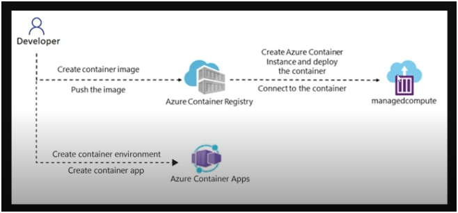
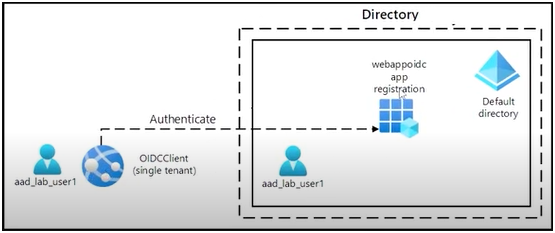
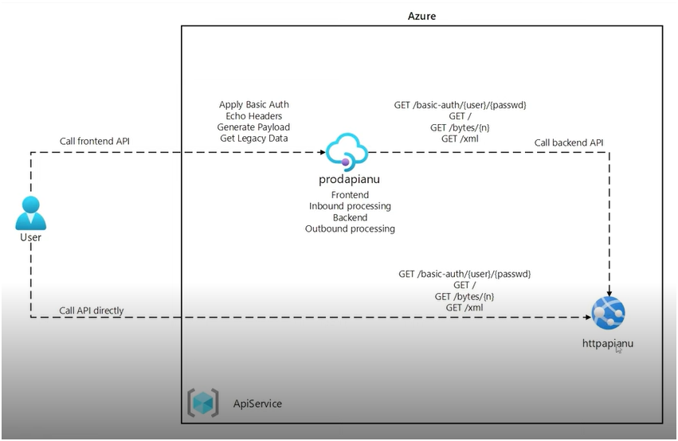

# AZ-204 Project

## Overview
This project is designed to help you prepare for the Microsoft Azure AZ-204 certification exam. The AZ-204 exam tests your skills in developing solutions for Microsoft Azure.

## Prerequisites
- Basic knowledge of Microsoft Azure services.
- Familiarity with programming languages such as C# or Python.
- Visual Studio or any other IDE of your choice.
- Azure Subscription
- Python installed

# FileApp
Build a console app to access, crate and list containers and upload files, using .net and python

## Project Structure
- `/dotnet`: Contains the source code for the dotnet project.
- `Program.cs`: Contains the main logic for connecting to Azure Storage, creating containers, and enumerating blobs.

- `/Py`: Contains the source code for the python project
- `/storage-service.py`: This Python script demonstrates how to interact with Azure Blob Storage using the Azure SDK for Python.

## Installation
1. Clone the repository:
    ```sh
    git clone https://github.com/Raphaellaucene/AZ-204-FileApp.git
    ```
2. Navigate to the project directory:
    ```sh
    cd AZ-204-FileApp
    ```
3. Install the required dependencies:
    ```sh
    dotnet add package Azure.Storage.Blobs
    ```
## Usage
1. Open the project in your preferred IDE.
2. Create a storage account with public access
3. Change the env variables to storage account name, secret and connection string

# Cosmos App Project
Test your skills developing a solution using a console app to crate a Azure Cosmos DB database on Azure, configure a console app, connect to Cosmos DB, create and list containers

## Installation
1. Azure Cosmos DB:
    ```sh
    pip install azure-cosmos
    ```
2. Variaveis de ambiente:
    ```sh
    pip install python-dotenv
    ```
3. Install the required dependencies:
    ```sh
    dotnet add package Azure.Storage.Blobs

For more information, please refer to the official documentation:
- .NET Documentation: https://learn.microsoft.com/dotnet
- Creating an App: https://learn.microsoft.com/azure/app-service/quickstart-dotnetcore
- Creating an App using Python: https://learn.microsoft.com/azure/app-service/quickstart-python
- Using Azure Storage Account: https://learn.microsoft.com/azure/storage/common/storage-account-overview
- Using Azure Cosmos DB: https://learn.microsoft.com/azure/cosmos-db/introduction

# Azure Container
Use ACR service (Azure Conatainer Registry) to developing containers and pipelines or using ACR Task to create container images to Azure.
Use ACI (Azure Container instance) to execute this images created previosly using CLI

### ACR
- Explain the benefits using ACR
- Describe how to using ACR's Task to create automatic builds and deploy
- Explain Dockerfile elements
- Create and run a ACR image using Azure CLI

### ACI
- Container Groups
- Explain restart policy
- YAML volume

## Tier
- Basic
- Standart
- Premium

# Container App
Azure Container Apps is a fully managed serverless platform that allows you to run containerized applications without worrying about infrastructure management.

- **Serverless Management**: Azure Container Apps handles server configuration, container orchestration, and deployment details, allowing you to focus on your application.

- **Automatic Scaling**: Applications can dynamically scale based on HTTP traffic, event-driven processing, CPU or memory load, and other KEDA-supported triggers.

- **Microservices and Jobs**: You can build microservices and run jobs on-demand, on a schedule, or based on events.

- **Built-in Ingress**: Enable HTTPS or TCP ingress without managing additional infrastructure.

- **Integration with Dapr**: Build microservices with Dapr and access its rich set of APIs.

- **Blue/Green Deployments**: Split traffic across multiple versions of an application for Blue/Green deployments and A/B testing.

- **Security and Monitoring**: Securely manage secrets, monitor logs using Azure Log Analytics, and use internal ingress for secure endpoints.

# Hands-on Container
Deploy workloads using images and containers. In this lab, we deploy a simple app for check if the network is available and, if so, retrieves and displays the current IP addresses of the host machine.



## Configurations
1. Compress to Archive PS:(local):
    ```sh
    Compress-Archive -Path .\* -DestinationPath .\LabHandsOn.zip
    ```
2. List Subscriptions (Azure CLI)
    ```sh
    az account list --output table
    ```
3. Create project folder:
    ```sh
    mkdir ~/ipcheck

4. Unzip folder:
    ```sh
    unzip ~/LabHandsOn.zip -d ~/ipcheck

5. Change permissions:
    ```sh
    chmod -R +xr ~/ipcheck

6. Create registry:
    ```sh
    registryName=conregistry$RANDOM

7. Listen registry:
    ```sh
    echo $resgistryName

8. Check ACR:
    ```sh
    az acr check-name --name $registryName

9. Create ACR:
    ```sh
    az acr Create --resource-group $rg --name $registryName --sku Basic

10. list acrs:
    ```sh
    az acr list --resource-group $rg

11. list acr by date:
    ```sh
    acrName=$(az acr list --resource-group $rg --query "max_by([], &creationDate).name" --output tsv)

12. Listen acr:
    ```sh
    echo $acrName

13. Build image:
    ```sh
    az acr build --registry $acrName --image ipcheck:latest .

14. Enable admin user:
    ```sh
    az acr update -n $acrName --admin-enable true


# Microsoft Authentication Library (MSAL)
Microsoft Authentication Library (MSAL) is a library developed by Microsoft that helps applications authenticate users and acquire tokens to access protected resources. It supports various authentication flows and integrates with Azure Active Directory (Azure AD) to provide secure access to Microsoft services and APIs.

## Key Features
- **Cross-Platform**: Available for .NET, JavaScript, Java, Python, and other platforms.
- **Single Sign-On (SSO)**: Provides SSO capabilities across applications.
- **Token Acquisition**: Acquires tokens for accessing Microsoft Graph, Azure services, and other APIs.
- **Secure Storage**: Securely stores tokens and credentials.
- **Support for Multiple Accounts**: Manages multiple user accounts and tenants.

## Common Use Cases
- **Web Applications**: Authenticate users and acquire tokens for accessing APIs.
- **Mobile Applications**: Enable secure sign-in and token acquisition on mobile devices.
- **Desktop Applications**: Integrate authentication and token management in desktop apps.
- **Daemon Services**: Acquire tokens for background services and daemons.

## Example
To acquire a token using MSAL in a .NET application:
```csharp
var app = PublicClientApplicationBuilder.Create(clientId)
    .WithAuthority(AzureCloudInstance.AzurePublic, tenantId)
    .Build();

var result = await app.AcquireTokenInteractive(scopes)
    .ExecuteAsync();

Console.WriteLine($"Token: {result.AccessToken}");
```

For more information, visit the [MSAL documentation](https://docs.microsoft.com/en-us/azure/active-directory/develop/msal-overview).


# Shared Access Signature (SAS)
is a URI that grants restricted access rights to Azure Storage resources. With SAS, you can provide limited access to containers, blobs, queues, and tables without sharing your account key. SAS tokens can be configured with specific permissions, start and expiry times, and IP address ranges.

### Types of SAS
1. **User Delegation SAS**: Uses Azure Active Directory (Azure AD) credentials to delegate access.
2. **Service SAS**: Grants access to specific resources in a storage account.
3. **Account SAS**: Grants access to resources in a storage account, such as service-level operations.

### Benefits
- **Granular Control**: Specify permissions, start and expiry times, and allowed IP ranges.
- **Security**: Avoid sharing account keys and use HTTPS to secure the SAS token.
- **Flexibility**: Generate SAS tokens for different types of access and resources.

### Example
To generate a SAS token for a blob, you can use Azure CLI:
```sh
az storage blob generate-sas --account-name <account_name> --container-name <container_name> --name <blob_name> --permissions r --expiry <expiry_time> --https-only
```
This command generates a SAS token with read permissions for a specific blob, valid until the specified expiry time.

For more information about SAS on Azure, you can refer to the official documentation: https://learn.microsoft.com/en-us/azure/storage/common/storage-sas-overview

# Microsoft Graph
Microsoft Graph is a unified API endpoint provided by Microsoft that allows developers to access a wide range of Microsoft 365 services and data. It enables you to interact with resources such as users, groups, mail, calendars, contacts, files, and more.

## Key Features
- **Unified API**: Access multiple Microsoft 365 services through a single endpoint.
- **Rich Data**: Retrieve information about users, groups, mail, calendars, contacts, files, and more.
- **Cross-Platform**: Use Microsoft Graph in web, mobile, and desktop applications.
- **Security**: Leverage Azure Active Directory for authentication and authorization.
- **Insights and Analytics**: Gain insights into user activity and organizational data.

## Common Use Cases
- **User Management**: Create, read, update, and delete user profiles and manage group memberships.
- **Mail and Calendar**: Access and manage emails, calendar events, and contacts.
- **Files and Drives**: Work with files stored in OneDrive and SharePoint.
- **Notifications**: Send notifications to users and groups.
- **Reports and Insights**: Generate reports and gain insights into organizational data.

### Example
To retrieve a list of users in your organization, you can use the following HTTP request:
```http
GET https://graph.microsoft.com/v1.0/users
```
This request returns a JSON response containing details about the users in your organization.

For more information, visit the [Microsoft Graph documentation](https://docs.microsoft.com/en-us/graph/overview).


# Hands-on Auth
Configure Entra ID sigle tenant and Create an ASP.NET web app. We register am app at Entra ID, using Graph explores for testing request at API for users account



## Configurations using AZ PS
1. Connect Entra ID:
    ```ps
    Connect-AzureAD
    ```
2. Get Domain name:
    ```ps
    $aadDomainName = ((Get-AzureAdTenantDetail).VerfiedDomains)[0].Name
    ```
3. Get Password Profile:
    ```ps
    $passwordProfile = New-Object -TypeName Microsoft.Open.AzureAD.Model.PasswordProfile

4. Set pass:
    ```ps
    $passwordProfile.Password = 'Pa55w@rd'

5. Set false to force Change Password:
    ```ps
    $passwordProfile.ForceChangePasswordNextLogin - $false

6. Create new user:
    ```ps
    New-AzureADUser -AccountEnabled $true -DisplayName 'aad lab user' -PasswordProfile $passwordProfile -MailNickName 'aad_lab_user -UserPrincipalName "aad_lab_user@$aadDomainName"

7. List new user:
    ```ps
    (Get-AzureADUser -Filter "MailNickName eq 'aad_lab_user'").UserPrincipalName

8. New MVC:
    ```ps
    dotnet new mvc --auth SingleOrg --client-id <clientid> --tenant-id <tenantid> --domain <yourdomain.com>

7. Create a self-signed certificate:
    ```ps
    dotnet dev-certs http --trust

# Azure Key Vault
Azure Key Vault is a cloud service that provides a secure store for secrets, keys, and certificates. It helps safeguard cryptographic keys and secrets used by cloud applications and services.

## Key Features
- **Secrets Management**: Securely store and manage sensitive information such as passwords, connection strings, and API keys.
- **Key Management**: Create and control the encryption keys used to encrypt your data.
- **Certificate Management**: Provision, manage, and deploy public and private SSL/TLS certificates.
- **Access Policies**: Define and enforce access policies to control who and what can access your secrets, keys, and certificates.
- **Monitoring and Logging**: Integrate with Azure Monitor to track and log access to your Key Vault.

## Benefits
- **Enhanced Security**: Protect sensitive data with hardware security modules (HSMs) and role-based access control (RBAC).
- **Centralized Management**: Manage all your secrets, keys, and certificates in a single, centralized location.
- **Compliance**: Meet compliance requirements with built-in security features and audit logs.
- **Scalability**: Scale seamlessly with your cloud applications and services.

## Example
To create a new Key Vault using Azure CLI, you can use the following command:
```sh
az keyvault create --name <keyvault_name> --resource-group <resource_group> --location <location>
```
This command creates a new Key Vault in the specified resource group and location.

For more information, visit the [Azure Key Vault documentation](https://docs.microsoft.com/en-us/azure/key-vault/).


# Azure Managed Identity
Azure Managed Identity is a feature of Microsoft EntraID that provides Azure services with an automatically managed identity in EntraID. This identity can be used to authenticate to any service that supports Azure AD authentication, without needing to manage credentials.

## Key Features
- **Credential Management**: Eliminates the need to manage credentials by providing an automatically managed identity.
- **Secure Access**: Enables secure access to Azure resources by using EntraID authentication.
- **Integration**: Easily integrates with Azure services such as Azure Key Vault, Azure Storage, and Azure SQL Database.

## Types of Managed Identities
1. **System-assigned Managed Identity**: Automatically created and managed by Azure for a specific Azure resource. When the resource is deleted, the identity is also deleted.
2. **User-assigned Managed Identity**: Created as a standalone Azure resource and can be assigned to one or more Azure resources. The identity persists even if the resources it is assigned to are deleted.

## Benefits
- **Simplified Credential Management**: No need to manually manage credentials or rotate secrets.
- **Improved Security**: Reduces the risk of credential exposure by using Azure AD authentication.
- **Seamless Integration**: Works seamlessly with Azure services that support Azure AD authentication.

## Example
To create a identity:
```sh
az identity create -g <resource_group> -n myUserAssignedIdentity
```

To create a identity for an Azure Virtual Machine using Azure CLI, you can use the following command:
```sh
az vm identity assign --name <vm_name> --resource-group <resource_group>
```
This command assigns a system-assigned managed identity to the specified virtual machine.

For more information, visit the [Azure Managed Identity documentation](https://docs.microsoft.com/en-us/azure/active-directory/managed-identities-azure-resources/overview).


# API Management
Azure API Management is a fully managed service that enables organizations to publish, secure, transform, maintain, and monitor APIs. It helps you manage the entire API lifecycle from creation to retirement.

## Key Features
- **API Gateway**: Acts as a facade for backend services, providing a single entry point for API consumers.
- **Developer Portal**: Allows developers to discover, learn about, and consume APIs. It includes interactive API documentation and a console for testing APIs.
- **Policy Engine**: Enables you to define and enforce policies such as rate limiting, IP filtering, and transformation on APIs.
- **Analytics and Monitoring**: Provides insights into API usage, performance, and health through built-in analytics and monitoring tools.
- **Security**: Supports various authentication mechanisms, including OAuth 2.0, JWT validation, and client certificate authentication.
- **Versioning and Revisioning**: Allows you to manage multiple versions and revisions of your APIs, ensuring backward compatibility and smooth transitions.

## Benefits
- **Centralized Management**: Manage all your APIs in a single, centralized location.
- **Enhanced Security**: Protect your APIs with advanced security features and policies.
- **Improved Performance**: Optimize API performance with caching, rate limiting, and load balancing.
- **Developer Engagement**: Foster a developer community with a customizable developer portal.
- **Scalability**: Scale your API management solution to meet the needs of your growing user base.

## Example
To create an API Management instance using Azure CLI, you can use the following command:
```sh
az apim create --name <apim_name> --resource-group <resource_group> --publisher-email <email> --publisher-name <name>
```
This command creates a new API Management instance in the specified resource group with the provided publisher details.

For more information, visit the [Azure API Management documentation](https://docs.microsoft.com/en-us/azure/api-management/).



# Hands-On Validate CPF

The HandsOnValidaCPF project is designed to validate Brazilian CPF numbers. This project includes methods and functions to verify the validity of a CPF number.

## Methods and Functions

### `ValidaCPF(cpf: string) -> bool`
This function checks if a given CPF number is valid.

**Parameters:**
- `cpf` (string): The CPF number to be validated.

**Returns:**
- `bool`: `True` if the CPF is valid, `False` otherwise.

**Example:**
```csharp
using ValidaCPF;

string cpf = "123.456.789-09";
if (fnvalidacpf.ValidaCPF(cpf))
{
    Console.WriteLine("The CPF is valid.");
}
else
{
    Console.WriteLine("The CPF is invalid.");
}
```

## Deploying the Function Locally

1. Create a new Azure Functions project:
    ```sh
    func init MyFunctionProj --worker-runtime dotnet
    ```

2. Create a new function:
    ```sh
    func new --name ValidateCPF --template "HTTP trigger"
    ```

3. Implement the function logic in `ValidateCPF.cs`.

4. Run the function locally:
    ```sh
    func start
    ```

## Deploying the Function to Azure

1. Create a new Azure Function App:
    ```sh
    az functionapp create --resource-group <resource_group> --consumption-plan-location <location> --runtime dotnet --functions-version 3 --name <function_app_name> --storage-account <storage_account_name>
    ```

2. Deploy the function code:
    ```sh
    func azure functionapp publish <function_app_name>
    ```

3. Test the function using the Azure portal or Azure CLI:
    ```sh
    az functionapp function show --resource-group <resource_group> --name <function_app_name> --function-name ValidateCPF
    ```

For more information, visit the [Azure Functions documentation](https://docs.microsoft.com/en-us/azure/azure-functions/).

## Contact
For any questions or feedback, please open an issue on the [GitHub repository](https://github.com/Raphaellaucene/AZ-204-FileApp).
